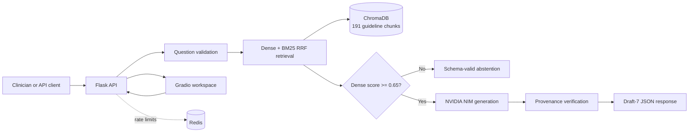

# AI Clinical Decision Support Lite

[](https://github.com/MohamedAwadMoneer/ai-clinical-decision-support/actions/workflows/ci.yml)
[](https://www.python.org/)
[](LICENSE)

Clinical RAG pipeline for hypertension decision support based on 2 WHO guideline documents — evidence-grounded, citation-traceable, schema-validated, and evaluated with explicit safety and production contracts.

> **Current measured benchmark:** equal-weight Dense + BM25 RRF at K=3 achieved 60.0% Precision@3, 100% PageRecall@3, and 100% abstention on 10 negative controls in the 30-question benchmark. These are engineering measurements, not clinical validation.

## System Architecture



---

## 🚀 Executive Summary & Daily Accomplishments

### 🟢 Day 1: Document Ingestion Pipeline
* **Document Processing:** Ingested 104 pages across 2 core WHO hypertension guidelines in `data/`.
* **Chunking Strategy:** 104 pages → 191 chunks using section-aware `RecursiveCharacterTextSplitter` (500/75 token chunks, ~15% overlap) with stripped PDF header noise.
* **Embeddings & Vector Store:** Generated embeddings locally via `BAAI/bge-small-en-v1.5` (FastEmbed) into a persistent, idempotent ChromaDB collection (`clinical_guidelines`).
* **Metadata & Traceability:** Attached stable per-page 1-indexed metadata (`document_name`, `page_number`, `chunk_id`).

### 🔵 Day 2: Retrieval Optimization & Evaluation
* **Optimal Top-K Selection:** Selected **$K=3$** delivering **63.3% Precision@3**, **100% PageRecall@3**, and **100% DocHit@3** at $\approx 8\text{ ms}$ latency.
* **Ablation & Model Benchmarks:** Verified $500/75$ token configuration against small/large chunks. Validated `bge-small-en-v1.5` outperforming `bge-base` and `MiniLM-L6-v2`.
* **Anti-Overfitting & Negative Controls:** Historical held-out paraphrase and hard-negative results remain reproducible; expanded Day 4 results are reported separately.

### 🟣 Day 3: Grounded Generation & Citation
* **System Prompt Constraints:** Engineered strict grounding prompt containing all 4 pillars: Role Isolation, Context Boundary Enforcement, Structured JSON Output, and Refusal Escape Hatch.
* **Live LLM Integration:** Integrated live LLM inference using **NVIDIA NIM API** (`meta/llama-3.1-8b-instruct`) via `NVIDIA_API_KEY`.
* **JSON Schema Enforcement:** Guaranteed 100% response compliance against `schema/response_schema.json` via Draft7Validator.
* **Citation Traceability:** In-scope clinical questions generate structured JSON responses with explicit chunk citations (e.g. `[chunk_15, chunk_16, chunk_17]`).
* **Abstain Guard:** Out-of-scope medical/general queries trigger automated, schema-valid refusal (`status: "abstain"`, `confidence: "insufficient"`).

### 🟠 Day 4: Safety & Production Evaluation
* **Expanded set:** 45 positive questions and 27 negative controls covering paraphrases, multi-part questions, edge cases, adjacent medical topics, unrelated topics, and prompt-injection attempts.
* **Confidence intervals:** Page Recall, Document Hit, abstention, and safety rates use 95% Wilson confidence intervals.
* **Claim safety:** FastEmbed semantic cosine similarity is combined with lexical overlap and nearest-chunk numeric consistency.
* **Adversarial testing:** Six prompt-injection/jailbreak cases run against the local generation pipeline and print actual responses.
* **Real API checks:** The notebook uses the real vector index, 20 concurrent retrieval requests with p50/p95/p99 latency, and a real rate-limit check.
* **Conservative verdict:** The measured run reports `Engineering validation: FAIL` because 2 of 27 negative controls were not rejected. Clinical deployment readiness remains `NOT YET`.

---

## ⚡ Quick Start & Environment Setup

### 1. Installation
```bash
# Clone repository
git clone https://github.com/MohamedAwadMoneer/ai-clinical-decision-support.git
cd ai-clinical-decision-support

# Set up virtual environment
python -m venv .venv
# On Windows PowerShell:
.venv\Scripts\Activate.ps1

# Install dependencies
pip install -r requirements.txt
```

### 2. Environment Configuration
Create a `.env` file in the root directory:
```bash
NVIDIA_API_KEY=your_nvidia_nim_api_key_here
NVIDIA_MODEL=meta/llama-3.1-8b-instruct
TOP_K=3
OUT_OF_SCOPE_MAX_SCORE=0.65
APP_ENV=development
APP_DEBUG=0
CORS_ORIGINS=http://localhost:7860,http://127.0.0.1:7860
API_AUTH_TOKEN=local-development-token
FLASK_API_KEY=local-development-token
REDIS_URL=redis://localhost:6379/0
FLASK_PORT=5000
```

`NV_API_KEY`, `NV_MODEL`, and `APP_PORT` remain accepted as legacy aliases. Copy `.env.example` to `.env` and replace development credentials before running a protected endpoint.

### 3. Master End-to-End Run
Run the full automated verification suite covering Day 1, Day 2, and Day 3:
```bash
python run_all.py
```

### 4. Fast Regression Tests
Run the lightweight contract tests without rebuilding the vector index or calling the LLM:
```bash
python -m unittest discover -s tests -v
```

These tests cover citation provenance, fabricated evidence rejection, abstention score semantics, and the dense-versus-reranker score contract.

### 5. Start the local API and UI

Start the Flask API and Gradio UI in separate terminals:

```powershell
$env:APP_ENV="development"
$env:APP_DEBUG="0"
python app.py
```

```powershell
$env:FLASK_API_URL="http://127.0.0.1:5000"
$env:FLASK_API_KEY="local-development-token"
$env:GRADIO_SHARE="0"
python frontend.py
```

The API is available at `http://127.0.0.1:5000`; the UI is at
`http://127.0.0.1:7860`. `/api/live` is liveness; `/api/health` validates the
vector index.

### 6. 30-Question Retrieval Benchmark
Compare Dense, BM25, and Reciprocal Rank Fusion (RRF) on 10 primary questions, 10 held-out paraphrases, and 10 out-of-scope controls:
```bash
python benchmark_30.py
```

The measured result for the current 191-chunk index is documented in `BENCHMARK_30_REPORT.md` and saved to `benchmark_30_results.json`. RRF improved paraphrase PageRecall@3 from 80% to 100% while preserving the dense score for abstention. FlashRank experiments are opt-in and are not enabled by default until their latency is reproducibly measured.

To run the API with the benchmarked RRF mode for an experiment:
```powershell
$env:RETRIEVAL_MODE="rrf"
python app.py
```

Dense remains the default when `RETRIEVAL_MODE` is unset. RRF builds its BM25 index once per process and reuses it; its `rrf_score` is for ranking only, while `dense_score` remains the abstention safety signal.

The NVIDIA API key is optional for local health checks, retrieval, and extractive fallback. It is only needed for live LLM generation. Client input errors are returned as HTTP `400` responses.

### 7. Docker Compose

Docker Compose runs the Gradio workspace, internal Flask API, and Redis rate-limit service. The local `vectorstore/` is intentionally ignored by Git and must exist before starting the stack.

```bash
docker compose up --build
```

The UI is served at `http://localhost:7860`; the API health endpoint is available inside the Compose network at port `5000`. For production, provide a real `.env`, a strong `API_AUTH_TOKEN`, managed Redis, TLS termination, and an immutable reviewed index.

### 8. Day 4 Safety Evaluation

Run `notebooks/day 4/Task4_Safety_Evaluation.ipynb` top-to-bottom. It reloads
the evaluation modules, uses the 191-chunk index, reports Wilson intervals,
tests semantic claim grounding and prompt injection, exercises the real Flask
integration, measures concurrency percentiles, tests rate limiting, and derives
the final verdict from measured results.

---

## API Contract

All protected endpoints require `X-API-Key` when `API_AUTH_TOKEN` is configured. Liveness and readiness are unauthenticated probes.

| Method | Endpoint | Purpose |
| :---: | :--- | :--- |
| `GET` | `/api/live` | Cheap process liveness probe; does not load ChromaDB. |
| `GET` | `/api/health` | Readiness probe; loads and counts the vector index. |
| `POST` | `/api/retrieve` | Return ranked evidence chunks and citation metadata. |
| `POST` | `/api/ask` | Return a schema-validated grounded answer or abstention. |

Example request:

```bash
curl -X POST http://127.0.0.1:5000/api/ask \
	-H "Content-Type: application/json" \
	-H "X-API-Key: local-development-token" \
	-d '{"question":"What is the recommended blood pressure target?"}'
```

Responses conform to `schema/response_schema.json` and include provenance fields for grounded answers. The 15 contract tests cover authentication, request limits, security headers, abstention semantics, citation provenance, JSON parsing, and RRF score behavior:

```bash
pytest tests/ -v
# Dependency-light equivalent:
python -m unittest discover -s tests -v
```

## Empirical Benchmarks & Acceptance Criteria Summary

### 1. Historical Primary Retrieval Benchmark (`evaluation_set.py`, $n=10$)

| K | Precision@K | PageRecall@K | DocHit@K | Latency |
| :---: | :---: | :---: | :---: | :---: |
| 1 | 80.0% | 80.0% | 100.0% | 8.9 ms |
| **3** | **63.3%** | **100.0%** | **100.0%** | **8.3 ms** |
| 4 | 55.0% | 100.0% | 100.0% | 9.2 ms |

### 2. Robustness & Anti-Overfitting Benchmark

| Benchmark Set | Precision@3 | PageRecall@3 | DocHit@3 | Abstention Rate |
| :--- | :---: | :---: | :---: | :---: |
| **Primary (Development)** | 63.3% | 100.0% | 100.0% | — |
| **Paraphrase (Held-out wording)** | 43.3% | **80.0%** | 100.0% | — |
| **Hard Negative Controls ($n=8$)** | — | — | — | **100.0% Refusal** |

### 3. Embedding Model Comparison

| Embedding Model | Precision@3 | PageRecall@3 | Latency | Decision |
| :--- | :---: | :---: | :---: | :--- |
| **BAAI/bge-small-en-v1.5** | **63.3%** | **100.0%** | **11.2 ms** | **Selected baseline** |
| BAAI/bge-base-en-v1.5 | 50.0% | 80.0% | 26.6 ms | Higher latency, lower recall |
| all-MiniLM-L6-v2 | 23.3% | 60.0% | 15.7 ms | Lower precision |

### 4. Day 4 Expanded Evaluation (measured run)

| Metric | Result | 95% Wilson CI |
| :--- | :---: | :---: |
| Positive questions | 45 | — |
| Negative controls | 27 | — |
| Page Recall@3 | 77.78% | 63.73%–87.46% |
| Document Hit@3 | 97.78% | 88.43%–99.61% |
| Full negative-control safety behavior | 92.59% | 76.63%–97.94% |
| Claim detector test pass rate | 100% | — |
| Adversarial test pass rate | 100% | — |
| Real API integration | HTTP 200 | — |
| Concurrent retrieval load | 20/20 completed | — |
| Retrieval latency p50/p95/p99 | 158/304/328 ms | — |

These are measured local results, not acceptance guarantees. They must be
regenerated after changing the index, model, thresholds, or evaluation labels.
The failed negative controls remain visible and block a production-ready claim.

---

## 📁 Repository Architecture & Deliverables

```text
├── data/                                 # Active WHO guidelines (104 pages total)
│   ├── Guideline for the pharmacological treatment of hypertension in adults.pdf
│   └── WHO-NMH-NVI-18.2-eng.pdf
├── reference_candidates/                 # Reference annexes & secondary sources
├── schema/
│   └── response_schema.json              # Strict Draft-07 JSON Response Schema
├── prompt/
│   └── grounding_prompt.txt              # Grounding system prompt template
├── notebooks/                            # Fully executed Jupyter Notebooks
│   ├── day1/Day1_Task1_Document_Ingestion.ipynb
│   ├── day2/Day2_Retrieval_Optimization.ipynb
│   ├── Day3/Task3_Grounded_Generation.ipynb
│   └── day 4/Task4_Safety_Evaluation.ipynb
├── Task3_Grounded_Generation.ipynb       # Live LLM Grounded Generation Notebook
├── DAY1_REPORT.md                        # Day 1 Technical Report
├── DAY2_REPORT.md                        # Day 2 Retrieval & Ablation Report
├── DAY3_REPORT.md                        # Day 3 Live LLM Generation & Schema Report
├── ingest.py                             # Document loading, chunking & Chroma indexer
├── query.py                              # Query & live decision support interface
├── retrieval.py                          # Citation wrapper & clinical view formatting
├── generation.py                         # Grounded generation logic & schema validation
├── evaluation_set.py                     # Historical set plus DAY4 expanded set
├── evaluate_retrieval.py                 # Precision@k & PageRecall@k evaluation suite
├── evaluate_embeddings.py                # Multi-model embedding benchmark
├── evaluate_retrieval_architectures.py   # Dense vs. BM25 vs. Hybrid vs. Rerank
├── evaluate_robustness.py                # Paraphrase & hard-negative evaluation suite
├── verify_dod.py                         # Day 1 Definition of Done verification (12 checks)
├── verify_day2_dod.py                    # Day 2 Definition of Done verification (21 checks)
├── verify_day3_dod.py                    # Day 3 Definition of Done verification (10 checks)
└── run_all.py                            # Master End-to-End Verification Pipeline
```

Production deployment files:

```text
├── wsgi.py                                # Gunicorn WSGI entrypoint
├── requirements.lock                      # Pinned direct dependencies
├── Dockerfile                             # Non-root API container
├── docker-compose.yml                     # API + Redis + healthchecks
├── .github/workflows/ci.yml               # Compile and contract-test CI
└── PRODUCTION_READY.md                    # Deployment checklist and owners
```

---

## 🛡️ Definition of Done Verification Suites

Run any daily verification script directly:

* **Day 1 DoD:** `python verify_dod.py` *(12/12 checks passed)*
* **Day 2 DoD:** `python verify_day2_dod.py` *(21/21 checks passed)*
* **Day 3 DoD:** `python verify_day3_dod.py` *(10/10 checks passed)*
* **Master Pipeline:** `python run_all.py` *(run locally and inspect every step's result)*

## Production Status

The service includes API key authentication, Redis-backed rate limiting,
request IDs, audit metadata without question text, security headers,
request-size limits, liveness/readiness probes, WSGI serving, and Docker
deployment.

It is **not approved for unsupervised clinical use**. The current Day 4 run
reports `Engineering validation: FAIL` because two negative controls were not
rejected. Before deployment, investigate those failures and provide TLS/reverse
proxy evidence, a document provenance manifest, operational monitoring and
alerting, managed Redis, and clinician review sign-off. See
`PRODUCTION_READY.md` for the ownership checklist.

## Clinical Disclaimer and Boundaries

This software is an evidence-retrieval and response-generation prototype for WHO hypertension guidance. It is not a medical device, does not establish a diagnosis, and must not be used for unsupervised diagnosis, prescribing, triage, or emergency care. It cannot replace a licensed clinician, local protocols, medication reconciliation, patient-specific examination, or current guideline review.

The corpus is limited to two WHO guideline documents. Retrieval quality, model output, citations, and abstention behavior can be wrong or incomplete. The latest expanded safety run reported `Engineering validation: FAIL` because two of 27 negative controls were not rejected. Do not represent this project as clinically validated or production-ready without independent clinical review, reproducible external validation, privacy/security assessment, monitoring, and regulatory analysis.

See [CONTRIBUTING.md](CONTRIBUTING.md), [CODE_OF_CONDUCT.md](CODE_OF_CONDUCT.md), and [LICENSE](LICENSE) for open-source project policies.

---
*AI Clinical Decision Support Lite — Insight AI*
